<h1>Challenge 2 - Literalura</h1>
<h2>Spring data JPA - Postgresql - Hibernate</h2>
<h4>Backend console application that allows you to search 
books on Gutendex API and register those in a database, along
with their authors data.</h4>

Choose an option from the Menu

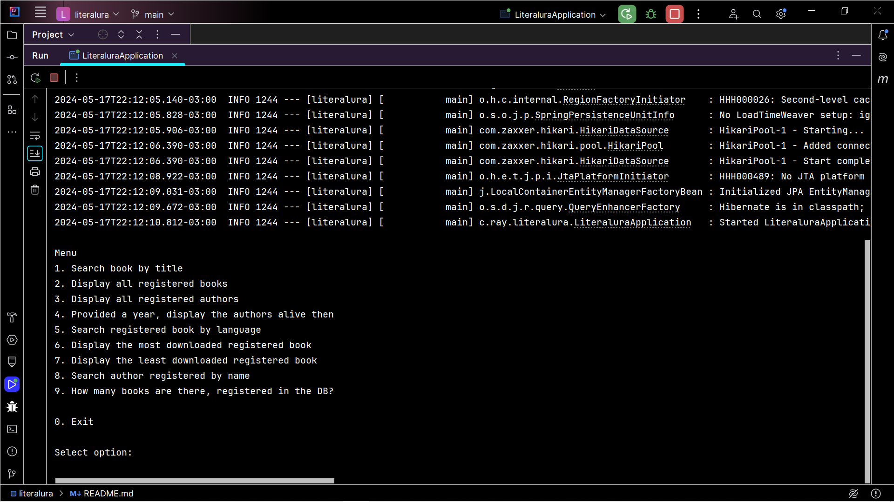

Enter the name of a book to search in the API and to be 
automatically registered in the Books and the Authors database

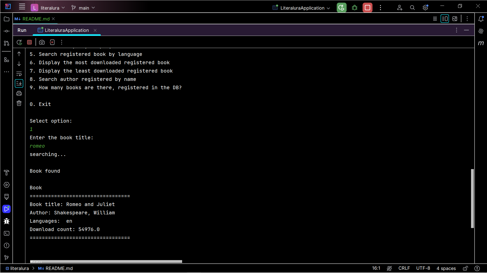

List all the books registered in the Books database

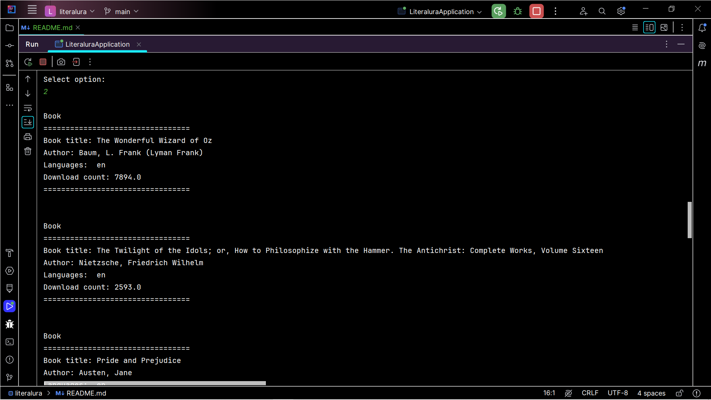

List all the authors registered in the Authors database

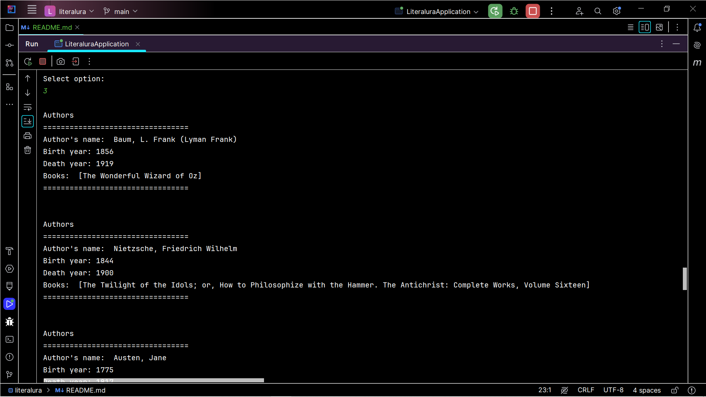

Postgres database has 2 tables: books and authors, which are
autopopulated upon searching books from the API

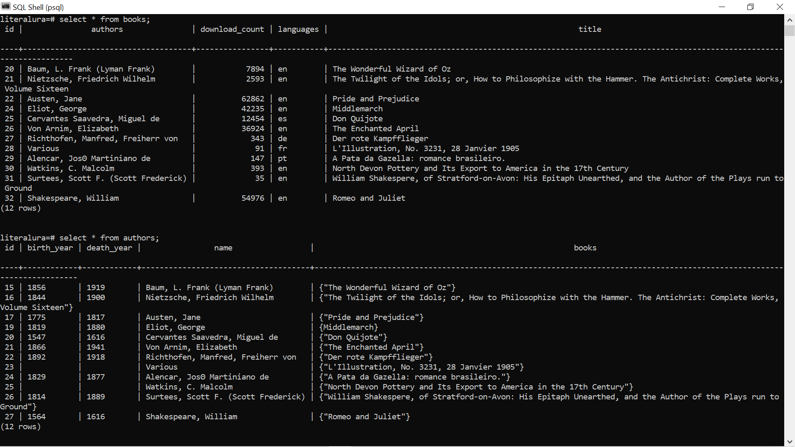

Providing a year, you can search for authors alive then

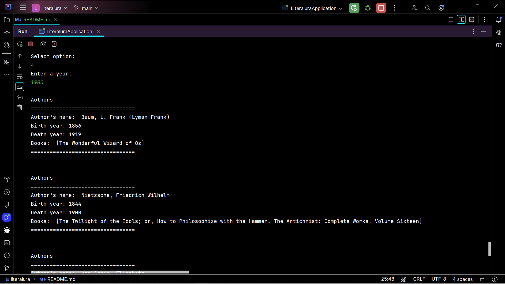

Providing a language from the list, search books in the
database

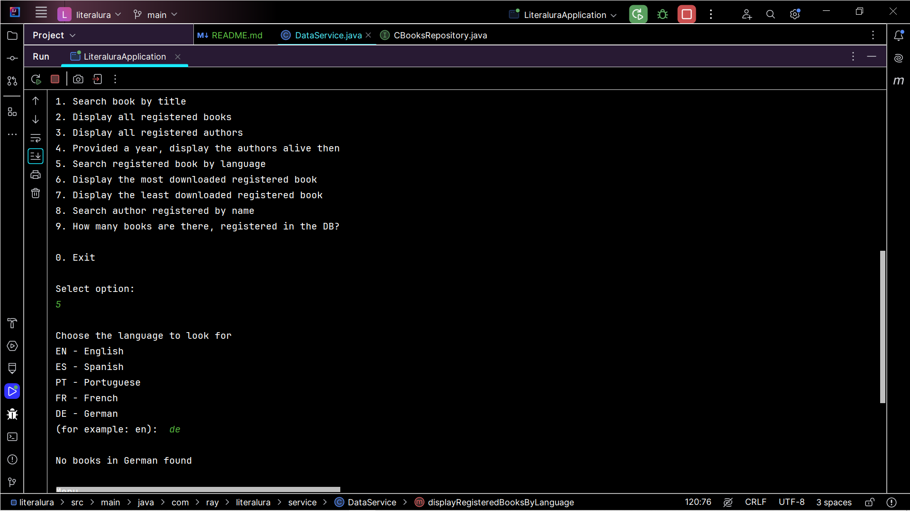
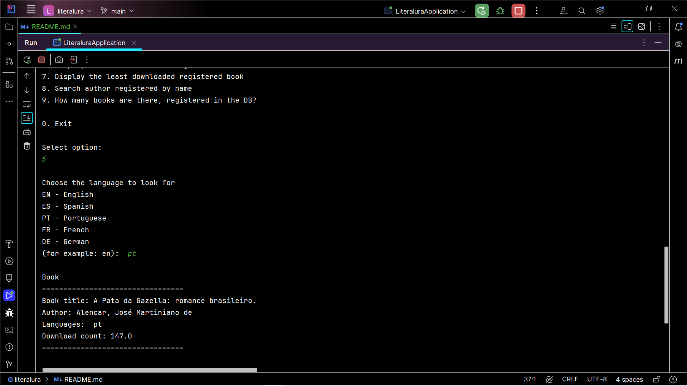

Display the most downloaded book from the database

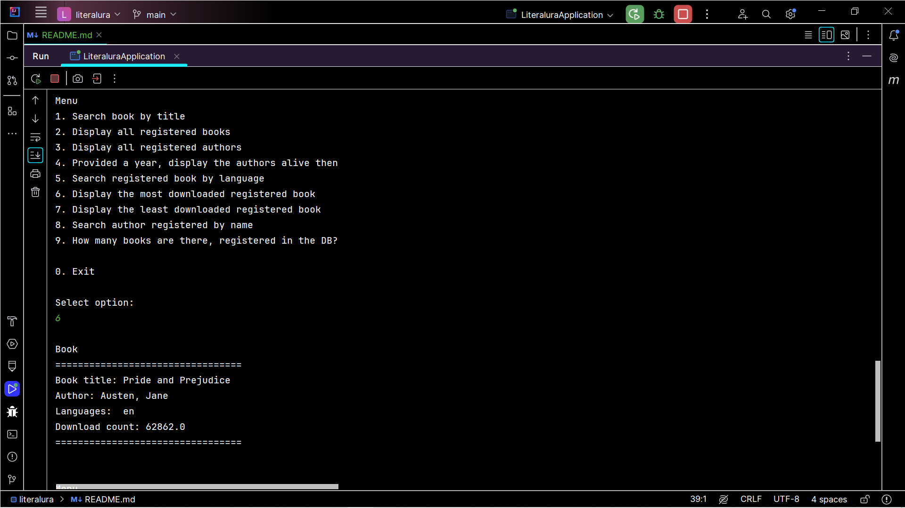

Display the least downloaded book from the database

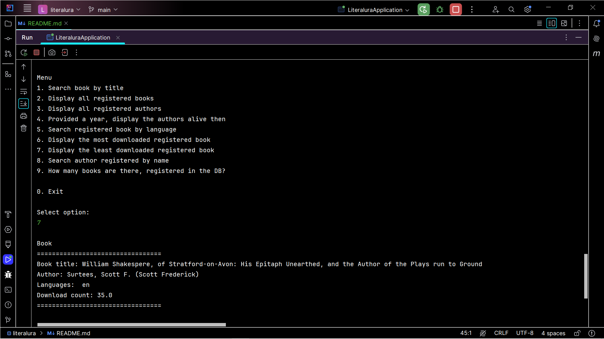

Search the authors database by author name

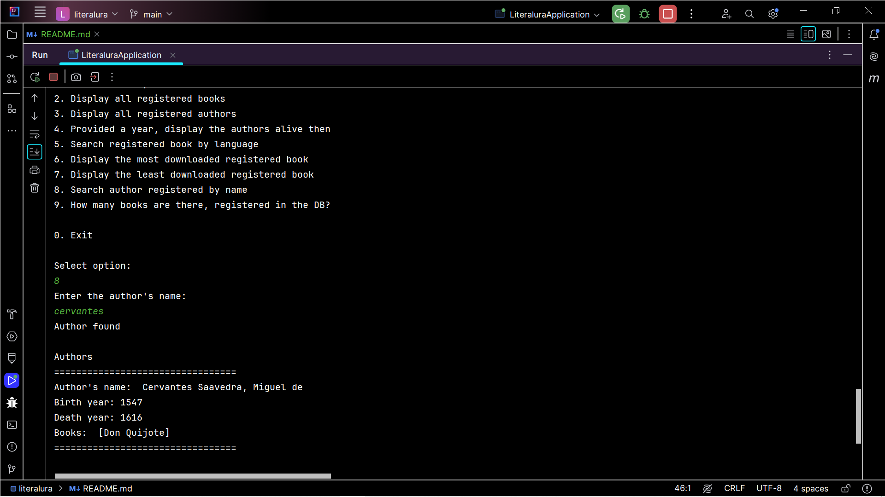

Get to know how many books there are in the database

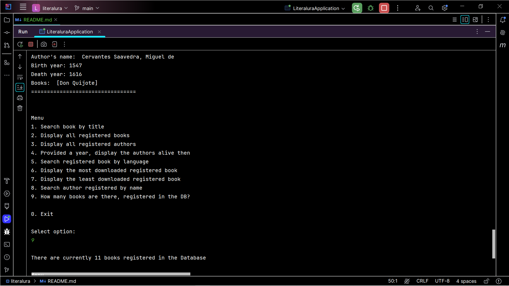

